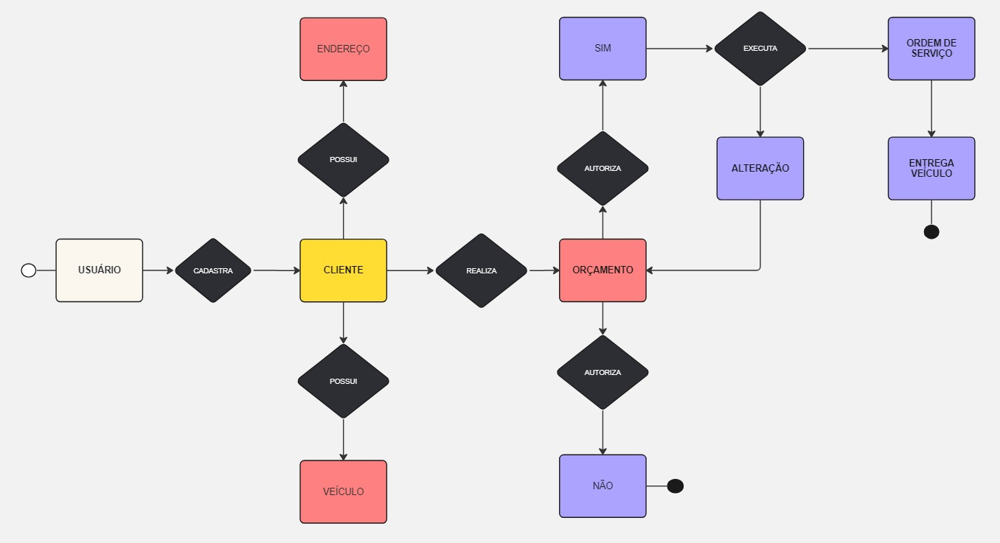

<h2>Desafio de projeto - OFICINA</h2>

Curso: SQL Fundamentos de Bando de dados

Profa: Juliana Mascarenhas

### :small_orange_diamond:**Objetivo:**

Cria o esquema **conceitual** para o contexto de oficina com base nos requisitos.

### :small_orange_diamond:**Requisitos:**

- Sistema de controle e gerenciamento de execução de ordens de serviço em uma oficina mecânica
- Clientes levam veículos à oficina mecânica para serem consertados ou para passarem por revisões periódicas
- Cada veículo é designado a uma equipe de mecânicos que identifica os serviços a serem executados e preenche uma OS com data de entrega.
- A partir da OS, calcula-se o valor de cada serviço, consultando-se uma tabela de referência de mão-de-obra
- O valor de cada peça também irá compor a OSO cliente autoriza a execução dos serviços
- A mesma equipe avalia e executa os serviços
- Os mecânicos possuem código, nome, endereço e especialidade
- Cada OS possui: n°, data de emissão, um valor, status e uma data para conclusão dos trabalhos.

Ferramentas:

<code></code> <code></code>

Links: 

### [Miro_app](https://miro.com/pt/app/): Para construção do DER

### [MySQL_Workbench](https://www.mysql.com/products/workbench/): Para modelagem e visualização do MER

### [MySQL](https://www.mysql.com/): Como SGDB

